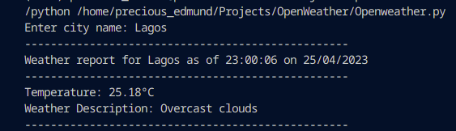

# OPENWEATHER 

- Using the OpenweatherAPI
- conatins the following:
    -  Allows you to enter the city name
    -  Gives the Weather report for the City inputted with current date and time
    -  Temperature and Weather Description

## Image:
 
 